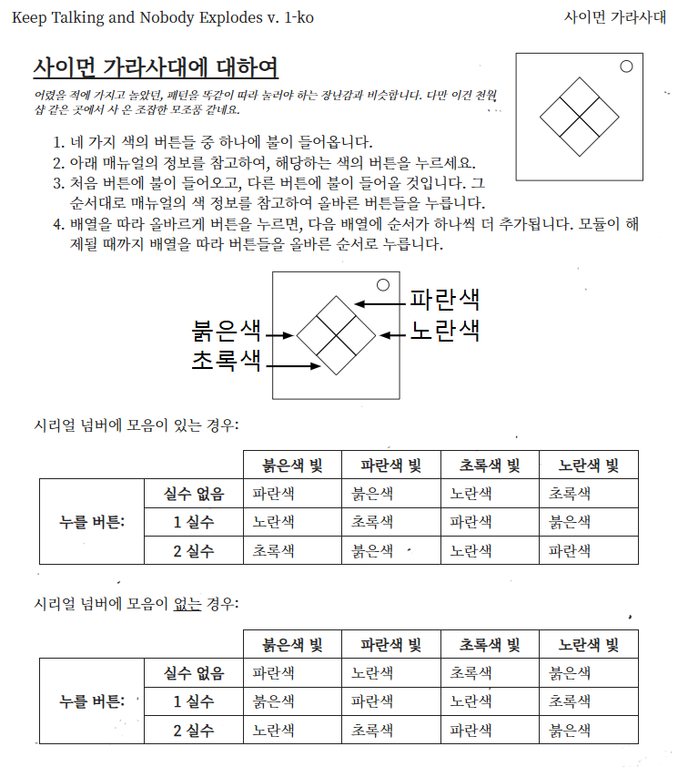

# pattern-memorize-game

**Demo Play** : https://202030129-jdh-project.netlify.app  

학교에서 과제로 자유주제 개인 프로젝트를 하라고 하길래 뭘 만들까 한참을 고민하다가 교수님께서 평소 수업 예제를 게임으로 가져오시길래 나도 게임을 만들기로 하고 만든 프로젝트.  

기본 아이디어는 게임 **keep talking and nobody explodes** 의 **사이먼 가라사대** 모듈을 참고, 각색해서 만든 게임  




## 게임 방법
한 턴은 ```패턴 보기``` -> ```패턴 입력하기``` 사이클을 가짐  
보여진 패턴을 그대로 기억해서 순서대로 버튼을 눌러 입력하는 **초 단기 암기 게임**  
단계가 올라갈수록 이전 패턴에 누적해서 새로운 패턴이 추가됨

## 주요 기능
- 사용자 피드백
    - 소리
    - 실패시 화면 효과
- 반응형  
모바일에서도 화면 최적화